# 🛡️ Aegis-RTO: Autonomous Self-Evolving Fraud Defense Engine

> **Razorpay AI Buildathon 2026 — Track 2: AI Risk Manager (Return-Risk Scorer & Adaptive Defense)**
> 
> *A production-grade, self-evolving risk engine that autonomously discovers, validates, and refines executable Python fraud defense rules to protect Indian e-commerce merchants from Return-to-Origin (RTO) and Cash-on-Delivery (COD) fraud.*

[](file:///c:/Users/Dell/Razorpay_buildathon/backend/tests)
[](https://razorpay.com/buildathon)
[](file:///c:/Users/Dell/Razorpay_buildathon/backend/app/engine/defense_audit.py)
[](file:///c:/Users/Dell/Razorpay_buildathon/backend/app/core/sandbox.py)
[](https://vercel.com)

---

## 📌 Executive Summary (The Problem in Simple Terms)

In Indian e-commerce, **Cash-on-Delivery (COD)** accounts for over **60% of all checkouts**, with **Return-to-Origin (RTO)** rates frequently reaching **25%–35%**. 

Every failed delivery costs merchants **₹150 to ₹350 in forward shipping, reverse courier fees, repackaging, and inventory lockup**.

### Why Traditional Systems Fail:
1. **Fraud Tactics Change Constantly (Concept Drift)**: Static rules and machine learning models trained on past data decay rapidly as fraudsters switch to new tactics (e.g., promo-code stacking, virtual device pools, high-velocity midnight ordering).
2. **The "Customer Insult" Trap**: Blocking a genuine customer's ₹1,500 order costs the merchant **₹225 in gross profit margin (15%)** and destroys customer trust. Symmetric models that aggressively optimize for recall trigger excessive false alarms, driving net business profit negative.
3. **Black-Box Retraining Delays**: Retraining traditional ML models (XGBoost/LightGBM) requires data scientists, manual labeling lag (5–7 days), and days of downtime.

### How Aegis-RTO Solves This:
Aegis-RTO is an **autonomous, closed-loop risk engine**. When fraud tactics shift, Aegis detects the change, diagnoses why previous rules failed, autonomously synthesizes new transparent Python rules, verifies them across rigorous cost gates, and promotes champions into production with **zero downtime**.

---

## 🏛️ Closed-Loop Autonomous Architecture (Fully Expanded)

> **Interactive version**: Run the dashboard locally (`npm run dev` in `frontend/`) and navigate to the **Architecture** tab for a zoomable, clickable version with plain-English breakdowns of every stage.

```mermaid
flowchart TD
    %% ── STYLES ──────────────────────────────────────────────────────────────
    classDef pipeline  fill:#eef2ff,stroke:#6366f1,stroke-width:2px,color:#1e1b4b,font-weight:bold
    classDef ensemble  fill:#ecfdf5,stroke:#059669,stroke-width:2.5px,color:#064e3b,font-weight:bold
    classDef routing   fill:#f0f9ff,stroke:#0284c7,stroke-width:2px,color:#0c4a6e,font-weight:bold
    classDef outcome   fill:#f8fafc,stroke:#64748b,stroke-width:2px,color:#0f172a,font-weight:bold
    classDef trigger   fill:#fffbeb,stroke:#d97706,stroke-width:2px,color:#78350f,font-weight:bold
    classDef sentinel  fill:#ffffff,stroke:#0284c7,stroke-width:2px,color:#0c4a6e,font-weight:bold
    classDef sentDrift fill:#ffffff,stroke:#7c3aed,stroke-width:2px,color:#3b0764,font-weight:bold
    classDef residual  fill:#fffbeb,stroke:#d97706,stroke-width:2.5px,color:#78350f,font-weight:bold
    classDef substep   fill:#ffffff,stroke:#fbbf24,stroke-width:1.5px,color:#1c1917
    classDef agent     fill:#faf5ff,stroke:#7c3aed,stroke-width:2px,color:#3b0764,font-weight:bold
    classDef gate      fill:#ecfdf5,stroke:#059669,stroke-width:2px,color:#064e3b,font-weight:bold
    classDef security  fill:#eef2ff,stroke:#4f46e5,stroke-width:2px,color:#1e1b4b,font-weight:bold
    classDef promoted  fill:#065f46,stroke:#34d399,stroke-width:2.5px,color:#ecfdf5,font-weight:bold
    classDef decision  fill:#fef9c3,stroke:#ca8a04,stroke-width:1.5px,color:#1c1917

    %% ── NODE 1: NEW ORDER STREAM ─────────────────────────────────────────────
    N1["⚡ **1. New Order Stream**
    Live Checkout Transaction Telemetry
    ━━━━━━━━━━━━━━━━━━━━
    &lt;10ms Scoring SLA · 17 Extracted Order Signals"]:::pipeline

    %% ── NODE 2: FROZEN SERVING ENSEMBLE ──────────────────────────────────────
    N2["🛡️ **2. Frozen Serving Ensemble** · LOCKED PRODUCTION
    Validated Python AST Rule Weights Snapshot
    ━━━━━━━━━━━━━━━━━━━━
    Zero Online LLM Dependency · Sub-millisecond Execution"]:::ensemble

    %% ── NODE 3: 3-WAY DECISION ROUTER ───────────────────────────────────────
    N3["**3. 3-Way Decision Router** · Zero Cherry-Picking
    ━━━━━━━━━━━━━━━━━━━━━━━━━━━━━━
    🟢 AUTO_APPROVE T&lt;0.35 · 🟡 MANUAL_REVIEW · 🔴 AUTO_BLOCK T≥0.70"]:::routing

    %% ── NODE 4: OUTCOME LOGGED ───────────────────────────────────────────────
    N4["🕐 **4. Outcome Logged & Maturation** · 5-DAY WINDOW
    Physical Delivery vs RTO Courier Labels
    ━━━━━━━━━━━━━━━━━━━━
    Settlement Window · Verified Ground Truth Ingestion"]:::outcome

    %% ── SECTION 5: TRIGGER LAYER ─────────────────────────────────────────────
    subgraph TRIGGERS["5. 🔔 Autonomous Adaptation Trigger Layer — Continuous Sentinels"]
        direction TB
        T5A["📊 **Spike Monitor**
        Sliding Binomial Z-Score
        ━━━━━━━━━━━━━━
        Z &gt; 2.50σ Anomaly Alert"]:::sentinel

        T5B["〰️ **Drift Detector**
        Population Stability Index (PSI)
        ━━━━━━━━━━━━━━
        PSI &gt; 0.25 Distribution Shift"]:::sentDrift

        T5C["🔍 **Residual Miner**
        False-Negative Cluster Isolation
        ━━━━━━━━━━━━━━
        Chi-Square p &lt; 0.01 Guard"]:::residual

        R1["📦 1. Mature Orders 5d+  · Ground Truth"]:::substep
        R2["🔵 2. Miss Clustering · HDBSCAN"]:::substep
        R3["✅ 3. Fisher's Exact Test · p &lt; 0.01"]:::substep
        R4["⏳ 4. Cooldown Check · 3 Rounds"]:::substep
        R5["⭐ **5. Defense Agenda** · Targeted Brief"]:::residual

        T5C --> R1 --> R2 --> R3 --> R4 --> R5
    end

    %% ── SECTION 6: MULTI-AGENT EVOLUTION LOOP ───────────────────────────────
    subgraph AGENTS["6. 🤖 Core Multi-Agent Evolution Loop & Safety Verification Gates"]
        direction TB
        A1["🧠 **1. Generator Agent** · LLM SYNTHESIS
        Synthesizes candidate Python AST boolean rules from agenda & reflections
        ━━━━━━━━━━━━━━━━━━━━━━━━━━━━
        Gemini / Claude · Guarded grammar · Zero eval()"]:::agent

        A2["⚙️ **2. Evaluator Agent** · SANDBOX EXEC
        Executes AST in memory sandbox; computes precision, recall, INR savings
        ━━━━━━━━━━━━━━━━━━━━━━━━━━━━
        Net Savings = TP×₹250 − FP×Margin Loss"]:::agent

        A3["🔄 **3. Reflector Agent** · CAUSAL DIAGNOSIS
        Diagnoses false positives & prescribes targeted rule boundary tightening
        ━━━━━━━━━━━━━━━━━━━━━━━━━━━━
        Self-Reflective Critique · Error Attribution"]:::agent

        A4["⚖️ **4. Selector & Pruner** · PARETO FRONTIER
        Greedy forward selection: prunes collinear rules and builds ensemble
        ━━━━━━━━━━━━━━━━━━━━━━━━━━━━
        Multi-Objective Optimization · Collinearity Guard"]:::agent

        G1["✔️ **5. Gate 1: Pre-Drift Regression** · SAFETY GATE
        Tests against historical training data Days 0–55. Enforces ≤5% regression
        ━━━━━━━━━━━━━━━━━━━━━━━━━━━━
        Zero-Tolerance Baseline Protection"]:::gate

        G2["🗄️ **6. Gate 2: Held-Out Validation** · SAFETY GATE
        Single-touch evaluation on physically isolated validation split Days 56–75
        ━━━━━━━━━━━━━━━━━━━━━━━━━━━━
        Prevents Data Snooping & Cherry-Picking"]:::gate

        G3["🛡️ **7. Decoy Guard & AST Audit** · SECURITY AUDIT
        Honeypot perturbation audit + zero circularity / decoy feature leakage
        ━━━━━━━━━━━━━━━━━━━━━━━━━━━━
        Zero Unauthorized Imports · Sandboxed Runtime"]:::security

        A1 -->|"candidate AST"| A2
        A2 -->|"valid AST"| A3
        A3 -->|"diagnosed candidate"| A4
        A4 -->|"pareto ensemble candidate"| G1
        G1 -->|"regression &lt; 5% ✅ PASS"| G2
        G2 -->|"validation split ✅ PASS"| G3
        G3 -->|"all gates verified ✅ PASS"| N7

        %% ── Retry Loops ─────────────────────────────────────────────────────
        A2 -->|"✕ syntax error / fast fail"| A1
        G1 -->|"✕ regression &gt; 5% — prune & re-mutate"| A1
    end

    %% ── NODE 7: PROMOTED CHAMPION ────────────────────────────────────────────
    N7["✨ **8. Promoted Champion Rule** · PROMOTED LIVE
    Promoted to Production Registry · Serving Weights Updated
    ━━━━━━━━━━━━━━━━━━━━━━━━━━━━
    Shadow Deployment → Canary Testing → Live Serving Snapshot Node 2"]:::promoted

    %% ── MAIN FORWARD PIPELINE ────────────────────────────────────────────────
    N1 -->|"stream"| N2
    N2 -->|"score &lt;10ms"| N3
    N3 -->|"log actions"| N4
    N4 -->|"mature courier ground truth"| TRIGGERS

    %% ── TRIGGER → AGENT FEEDS ────────────────────────────────────────────────
    T5A -->|"spike agenda"| A1
    T5B -->|"drift agenda"| A1
    R5  -->|"feeds agenda into Generator"| A1

    %% ── MAIN PROMOTION RETURN LOOP ───────────────────────────────────────────
    N7 -->|"↻ if promoted — atomic snapshot update"| N2
```



### The 8-Stage Lifecycle

| Stage | Name | Role |
|:---:|---|---|
| **1** | New Order Stream | Live checkout telemetry evaluated in &lt;10ms |
| **2** | Frozen Serving Ensemble | Locked Python AST rule snapshot — zero LLM at inference |
| **3** | 3-Way Decision Router | Auto-Approve / Manual Review / Auto-Block by threshold |
| **4** | Outcome Logged & Maturation | 5-day delivery truth window before labelling |
| **5** | Autonomous Trigger Layer | Spike Monitor + Drift Detector + Residual Miner sentinels |
| **6** | Multi-Agent Evolution Loop | Generator → Evaluator → Reflector → Selector/Pruner |
| **7** | Safety Verification Gates | Gate 1 (Regression) → Gate 2 (Held-Out) → Decoy Guard |
| **8** | Promoted Champion | Atomic snapshot update back into Node 2 — zero downtime |

1. **1. New Order Stream**: Live checkouts are evaluated in sub-10ms against the serving rule snapshot.
2. **2. Frozen Serving Ensemble**: Rules execute inside a secure, sandboxed Abstract Syntax Tree (AST) evaluator without `eval()`, `exec()`, or file access.
3. **3. 3-Way Decision Routing**:
   * **Auto-Approve ($\text{Risk} < 0.35$)**: 96.06% of orders flow friction-free to fulfillment.
   * **Auto-Block ($\text{Risk} \ge 0.70$)**: High-confidence fraud is blocked automatically.
   * **Human Review ($0.35 \le \text{Risk} < 0.70$)**: Ambiguous orders are isolated for analyst triage.
4. **4. Outcomes Logged (5-Day Maturation)**: Delivery statuses (Delivered vs RTO) mature over 5 days to prevent in-flight orders from creating false ground truth.
5. **5. Autonomous Triggers**:
   * **Spike Monitor**: Real-time binomial Z-score ($Z > 3.0\sigma$) & CUSUM detector catching coordinated fraud surges with 0 label lag.
   * **Concept Drift Detector**: Population Stability Index ($\text{PSI} > 0.25$) detecting shifts in order value or pincode distributions.
   * **Residual Miner**: Scans mature false negatives, clusters misses, filters by statistical significance ($\chi^2 < 0.05$), enforces a 3-round cooldown, and creates targeted agendas.
6. **6. Multi-Agent Evolution & Verification Gates**:
   * `Generator Agent` $\to$ `Evaluator Agent` $\to$ `Reflector Agent` (diagnoses false positives and loops back feedback) $\to$ `Selector Agent` (prunes redundancies) $\to$ `Gate 1 (Regression Check)` $\to$ `Gate 2 (Single-Touch Held-Out Test)` $\to$ `Decoy Guard` $\to$ **Promoted champion rules update Node 2 atomically**.

---

## 💰 The Financial ROI Equation

Aegis-RTO optimizes for **Merchant Net Profit**, not vanity metric accuracy:

$$\text{Net Value} = (\text{True Positives} \times ₹250\text{ Shipping Loss Avoided}) - \sum (\text{False Positive Order Value} \times 15\%\text{ Profit Margin Lost})$$

### The 22.26% Break-Even Precision Hurdle:
At an average order value (AOV) of ₹1,123.36:
* Saving 1 RTO prevents: $+₹250$
* Insulting 1 genuine customer loses: $₹1,123.36 \times 15\% = -₹168.50$
* **Minimum viable precision required**:
  $$\text{Break-Even Precision} = \frac{₹168.50}{₹250 + ₹168.50} = 22.26\%$$

Any fraud system operating below 22.26% precision destroys merchant wealth. Aegis-RTO operates at **37.25%–42.86% precision**, ensuring every automated decision delivers positive net cash flow.

---

## 📊 Empirical Results & Verification

### 1. Final Held-Out Test Set Proof (2,641 Unseen Orders, Days 76–89)

| Metric | Result | Operational Meaning |
|---|---|---|
| **Total Test Dataset** | **2,641 Orders** | 100% unseen post-drift chronological split |
| **Auto-Decision Rate** | **2,588 Orders (97.99%)** | Processed sub-millisecond without human labor |
| **Auto-Approved Orders** | **2,537 Orders** | Clean orders passed to fulfillment |
| **Auto-Blocked Orders** | **51 Orders** | High-confidence fraud intercepts |
| **Auto-Decided Precision** | **37.25%** | Far above the 22.26% break-even hurdle |
| **Manual Review Volume** | **53 Orders (2.01%)** | Ambiguous cases isolated for analysts |
| **Review Queue Risk Concentration** | **47.17% (1.52x)** | Concentrates fraud 1.52x for rapid human review |
| **Auto Net Financial Savings** | **+₹2,458.91** | Net profit after all customer insult costs deducted |

---

## 🛡️ Data Integrity & Security Safeguards

1. **Physical Table Segregation**: `orders_train` (Days 0–55), `orders_validation` (Days 56–75), and `orders_held_out_test` (Days 76–89) reside in physically isolated database tables.
2. **Sandboxed AST Execution**: All candidate rules execute in a restricted Python Abstract Syntax Tree (AST) runtime with CPU timeouts, blocking `eval()`, `exec()`, `import`, and disk access.
3. **Locked Single-Touch Test Split**: The 2,641 held-out test orders are evaluated strictly once at final Gate 2 verification.
4. **Decoy Features Audit**: Candidate rules referencing circular non-causal features (e.g. `device_model_name`, `app_theme_color`) are rejected automatically.

---

## 🚀 Local Recreation Guide (Step-by-Step)

### Option A: Local Run with Python + Node.js

#### 1. Clone & Setup Backend
```bash
# 1. Clone the repository
git clone https://github.com/MOHILMANDAPE15/Razorpay_buildathon.git
cd Razorpay_buildathon

# 2. Create and activate Python virtual environment
python -m venv .venv

# On Windows (PowerShell):
.venv\Scripts\activate
# On Linux / macOS:
source .venv/bin/activate

# 3. Install backend dependencies
pip install -r backend/requirements.txt

# 4. Copy environment configuration
cp .env.example .env
# (Optional: Add your GROQ_API_KEY or GEMINI_API_KEY in .env for live LLM rule generation)

# 5. Ingest datasets into SQLite database
python -m app.db.ingest

# 6. Start FastAPI Backend (Port 8080)
python -m uvicorn app.api.main:app --port 8080 --host 127.0.0.1
```

#### 2. Setup & Start Frontend Dashboard
```bash
# Open a new terminal:
cd Razorpay_buildathon/frontend

# 1. Install Node.js dependencies
npm install

# 2. Start Next.js Development Server (Port 3300)
npm run dev -- -p 3300 -H 127.0.0.1
```

Visit the dashboard in your browser at: **`http://localhost:3300`**

---

### Option B: 1-Command Run with Docker Compose

```bash
# Clone the repository
git clone https://github.com/MOHILMANDAPE15/Razorpay_buildathon.git
cd Razorpay_buildathon

# Build and run both backend and frontend
docker compose up --build
```

The system will start automatically:
* **Frontend Dashboard**: `http://localhost:3300`
* **FastAPI Backend**: `http://localhost:8080`
* **API Documentation**: `http://localhost:8080/docs`

---

## ☁️ Deploying to Vercel (Production Setup)

Aegis-RTO is structured for seamless deployment with the Next.js frontend on Vercel and the FastAPI backend on any cloud provider (Render, Railway, Fly.io, or AWS).

### Step 1: Deploy Backend (e.g. Render / Railway)
1. Deploy `backend/` as a Python web service (or use the provided `backend/Dockerfile`).
2. Set the start command: `python -m uvicorn app.api.main:app --host 0.0.0.0 --port 8080`.
3. Add environment variables: `GROQ_API_KEY` (or `GEMINI_API_KEY`).
4. Note your backend URL (e.g., `https://aegis-rto-api.onrender.com`).

### Step 2: Deploy Frontend on Vercel
1. Import the repository into [Vercel](https://vercel.com).
2. Set the **Root Directory** to `frontend`.
3. Framework Preset: **Next.js**.
4. In **Environment Variables**, add:
   * `NEXT_PUBLIC_API_URL` = `https://aegis-rto-api.onrender.com/api/v1`
   * `BACKEND_URL` = `https://aegis-rto-api.onrender.com`
5. Click **Deploy**. Vercel will build and launch the production dashboard.

---

## 🧪 Judge Automated Verification Checklist

You can verify the entire test suite and scientific scripts in seconds:

```bash
# 1. Run all 65 unit and integration tests (100% pass rate)
python -m pytest backend/tests/ -v

# 2. Run the live Evolution Engine demo
python backend/scratch/run_evolution_demo.py

# 3. Run the live Residual Miner execution demo
python backend/scratch/run_residual_miner_demo.py

# 4. Verify paired bootstrap significance & shadow control
python backend/scratch/run_shadow_control.py
```

---

## 📁 Repository Structure

```
├── backend/
│   ├── app/
│   │   ├── agents/          # Generator, Evaluator, Reflector, Selector agents
│   │   ├── api/             # FastAPI endpoints (scoring, lineage, monitor, review)
│   │   ├── core/            # AST sandbox runtime, LLM client factory, config
│   │   ├── data/            # Data loaders with single-touch split guards
│   │   ├── db/              # SQLAlchemy ORM models, session, CSV ingestion
│   │   └── engine/          # Router, Evaluator, Spike Monitor, Residual Miner
│   ├── Dockerfile           # Backend containerization
│   ├── requirements.txt     # Python dependencies
│   └── tests/               # 65 automated tests (100% pass rate)
├── frontend/
│   ├── src/
│   │   ├── app/             # Next.js pages: Overview, Knowledge Graph, Mining, Monitor, etc.
│   │   ├── components/      # ArchitectureDiagram, InfoTooltip, ChatWidget, Drawers
│   │   └── lib/             # Typed API client & centralized glossary
│   ├── Dockerfile           # Frontend containerization
│   ├── package.json         # Node.js dependencies
│   └── vercel.json          # Vercel deployment configuration
├── idea_and_data/
│   ├── train.csv            # Days 0–55 (10,807 orders, baseline pre-drift)
│   ├── validation.csv       # Days 56–75 (3,885 orders, drift ramp-in)
│   ├── held_out_test.csv    # Days 76–89 (2,641 orders, frozen test split)
│   └── data_card.md         # Full dataset documentation
├── docker-compose.yml       # 1-command fullstack local reproduction
├── .env.example             # Environment variables template
└── README.md                # Comprehensive documentation
```

---

## ❓ Frequently Asked Questions (FAQ)

#### Q1: "Why does Aegis auto-block 51 orders instead of hundreds?"
> **Answer**: In fraud risk management, an aggressive model flagging 500 orders will inevitably trigger hundreds of false positives. At ₹1,123 AOV, each false alarm destroys ₹168 in merchant margin. Aegis auto-blocks only high-confidence fraud ($T \ge 0.70$), while isolating ambiguous cases ($0.35 \le T < 0.70$) into the Analyst Review Queue where fraud density is concentrated by **1.52x**.

#### Q2: "How does the system prevent arbitrary code execution from generated rules?"
> **Answer**: Candidate rules execute inside [`sandbox.py`](file:///c:/Users/Dell/Razorpay_buildathon/backend/app/core/sandbox.py) using static Abstract Syntax Tree (AST) validation. The sandbox parses rule syntax before execution, blocking all `import`, `open`, `eval`, `exec`, `__subclasses__`, and OS operations.

#### Q3: "What prevents the Residual Miner from repeatedly proposing rejected rules?"
> **Answer**: Aegis enforces a **3-Round Cluster Cooldown**. When a candidate rule for a false-negative cluster is rejected by the cost gate or pruned, its cluster ID enters cooldown in the database. During cooldown, the cluster is suppressed unless miss volume surges by $>50\%$.

---

## 👥 Author & Contact

* **Author**: Mohil Mandape
* **GitHub**: [@MOHILMANDAPE15](https://github.com/MOHILMANDAPE15)
* **Email**: mohilmandpe33@gmail.com
* **Track**: Razorpay AI Buildathon 2026 — Track 2 (Return-Risk Scorer / AI Risk Manager)
